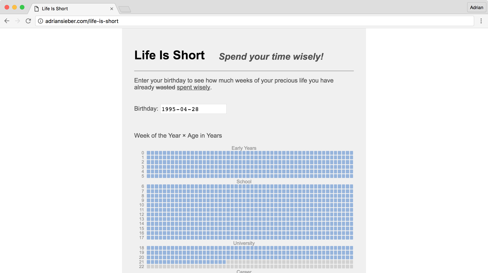

# Life is Short

Just a little reminder of how much time of your life you've already wasted 😉.

## TODO

- [ ] Switch between week and day view
- [ ] Write birthday in url-hash
- [ ] Save latest birthday in local storage

## Related

- [Lifechart](https://infertux.com/labs/lifechart/)
- [imgur.com/67aHKhF](https://imgur.com/67aHKhF)
- [waitbutwhy.com/2014/05/life-weeks.html](
    https://waitbutwhy.com/2014/05/life-weeks.html)
- [github.com/hychen/lifeistooshort-chrome-extension](
    https://github.com/hychen/lifeistooshort-chrome-extension)
- [Live-A-Little] - E-ink life progress bar.
- [Habit Calendar] - Customizable and printable habit tracker.
- [LifeTime] - LED display showing months lived in a 90 year lifetime.

[Habit Calendar]: https://habitcalendar.co/
[LifeTime]: https://blog.adafruit.com/2024/11/01/lifetime-displays-months-lived-in-a-90-year-lifetime/
[Live-A-Little]: https://hackaday.io/project/180219-live-a-little
